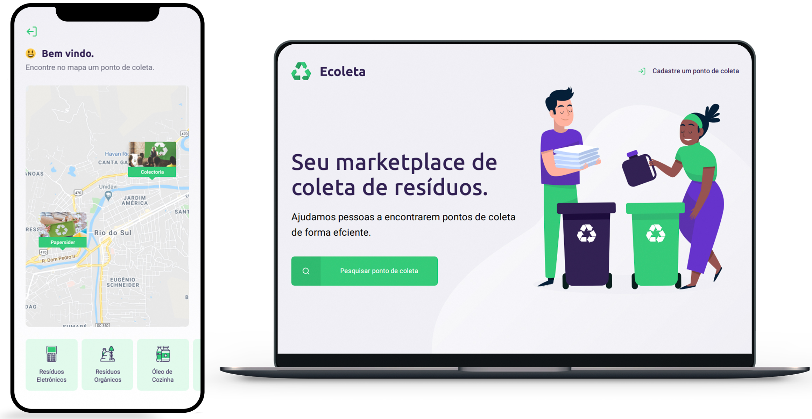

<div align="center">
  <br>
</div>

# Ecoleta
O Ecoleta é uma aplicação Web e Mobile para ajudar pessoas a encontrarem pontos de coleta para reciclagem.

Essa aplicação foi construída na trilha Booster da Next Level Week distribuída pela **Rocketseat**. A ideia de criar uma aplicação voltada ao meio ambiente surgiu da coincidência da data do curso e a data da semana do meio ambiente.

# Instalação
Para clonar o repositório, execute o seguinte comando no terminal:
```git clone https://github.com/dyegosoriano/Ecoleta.git```

## Pré-Requisitos 
```node, express, knex, sqlite, react, react-native, expo```

Clone o repositório, utilizando git clone ou faça o download do repositório.

Para iniciar o **Backend** utilize os comandos:
```
cd backend
yarn install && yarn development
```
A API Node vai funcionar na porta ```localhost:3333```.

Para iniciar o **Frontend** utilize os comandos:
```
cd frontend
yarn install && yarn start
```

Assim que o processo terminar, será aberta uma página no seu navegador ``localhost:3000`` contendo o projeto.

Para testar o **Mobile** do React Native, primeiro coloque o endereço do seu servidor (ou computador) no arquivo **src/services/api.js**, e depois execute os comandos:
```
# NÃO é preciso executar a linha de baixo caso ja tenha o Expo (CLI) instalado!
yarn global add install expo-cli
cd mobile
yarn install && expo start
```
Assim que o processo terminar, automaticamente será aberta no seu navegador a página ``localhost:19002``. Conecte seu emulador, ou teste o aplicativo por ``LAN``: baixe o aplicativo *Expo* da Play Store ou App Store e em seguida escaneie o código QR. (Se não for por lan, tente por tunnel, espere aparecer no Metro Blunder(informações do Expo sobre o app) a mensagem *Tunnel Ready* então clique em tunnel e escaneie o código QR.

# Projeto


# Back-End
Api desenvolvida em NodeJS com acesso a banco de dados relacional SQLite. Esta api faz uso do Knex.

As rotas para acessar a API estão no arquivo **routes.js**. Você pode testar as rotas antes de usar o frontend com o software Insomnia.

# Front-End (Web e Mobile)
Frontend web, desenvolvido em ReactJS. Nesta parte da aplicação, é possível entender diversos conceitos do React e do desenvolvimento web em geral. 

Além disso, é muito importante entender como a página web normalmente se comunica com a API por meio de requisições http, as quais retornam ao frontend como um objeto json. Neste caso, foi utilizada a lib axios para realizar a comunicação com a api.

Com isso, a página da aplicação Ecoleta será aberta. Nela, um estabelecimento comercial poderá se cadastrar e cadastrar seus pontos de coleta de resíduos.

# Mobile
Desenvolvido com o framework React Native e com o Expo.

# Licença
Esse projeto está sob a licença MIT.